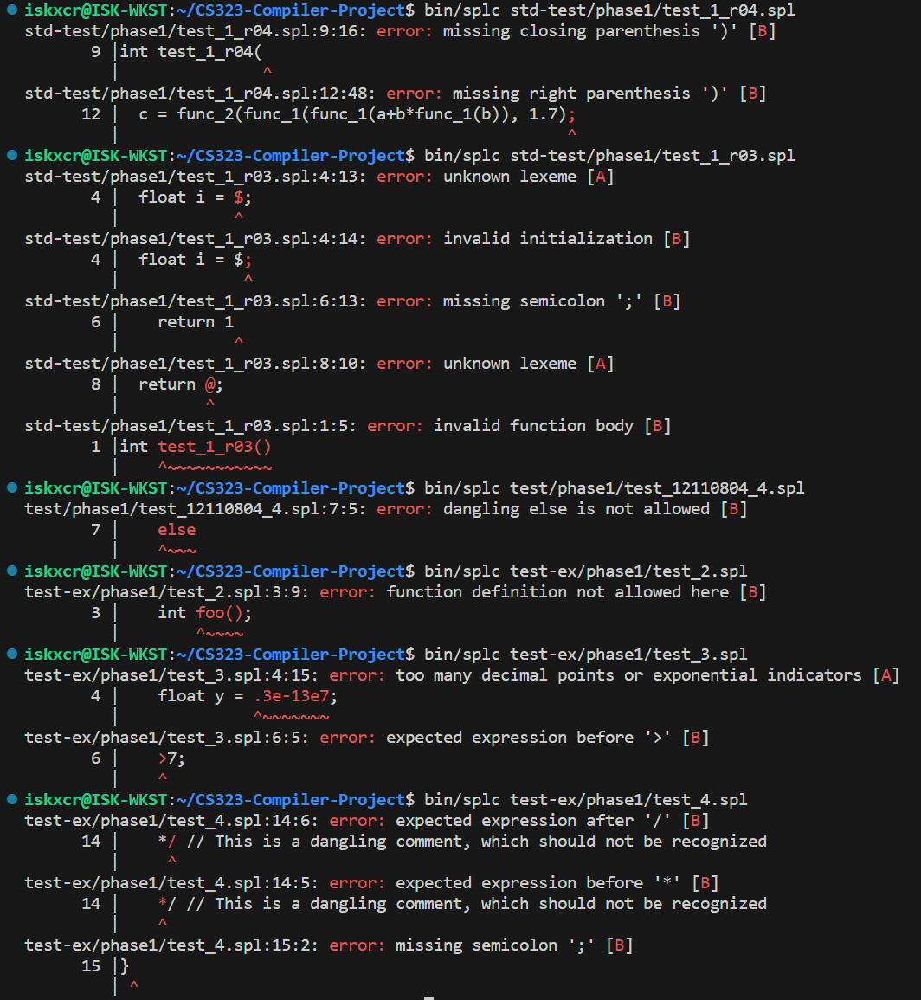
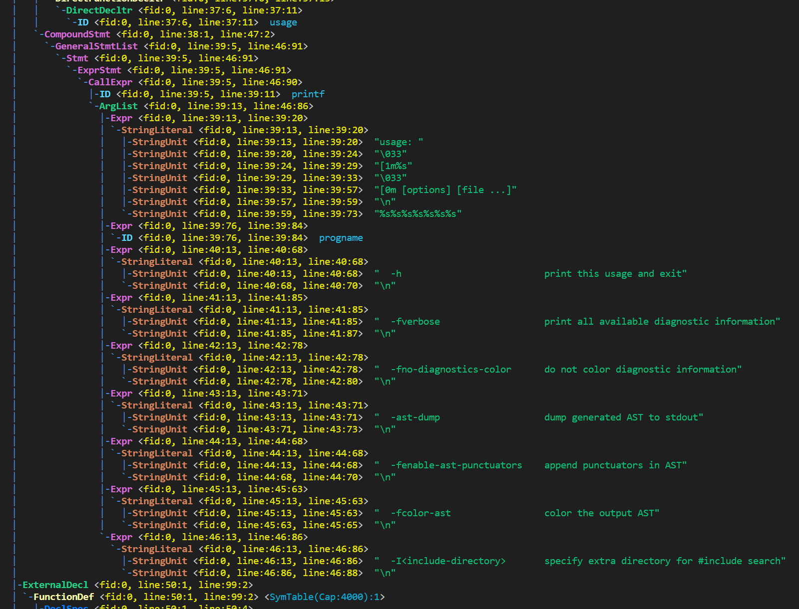
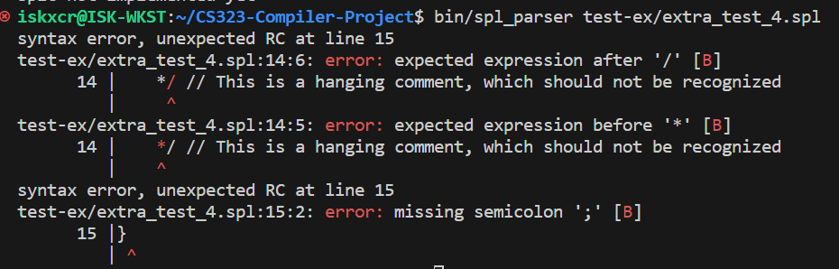

# CS323-Compiler-Project

## TODO
- Main structure
  - **SPL Grammar**:
    - **C Preprocessor**
      - Macro variable/function substitution
        - *(Done) Macro variable substitution*
        - (Ongoing) Macro function substitution
      - *(Done) Recursive file inclusion*
    - **Parser**:
      - *(Done) Pointer/Address-Of Support*
      - *(Done) Support All C operators*
      - *(Done) Support type-qualifiers*
    - **Semantic Analyzer**
      - *(Done)* Analyzer passes are structed into a general one
      - (Ongoing) Extensible semantic analyzing
  - **Utilities**
    - *(Done) LUT (Look-Up Table)*
    - *(Done) Full AST Support*
    - *(Done)* `clang`-like AST dump
    - *(Done)* `clang`-like message from compiler
    - *(Done)* Error tracking during all steps

## Phase 1

### Extended Feature List
- Error Detection:
  - Any sentential form that violates ANSC or supported C99 grammar will be reported.

- Optimized error/warning output

  

  **This may cause the `diff`** **utility not to work when batch verifying**, as ASCII control sequences are used to color the output and they will not be recognized by `diff`.

  The parsing tree will not be colored.
- Allow partial C99/C11 features.
  - The exception being `generic-selection` and `generc-association`.
  - **Examples**:
    - Recursive macro substitution
    - Almost all C99 grammar
  Please see the attached example in `test/test-func/phase1.c`, which contains a copy of the source code from this compiler.
  ```c
  #define NULL (void *)0
  typedef unsigned long long size_t;
  /* From `splcdef.h` */

  int splc_incl_dir_cnt = 0;
  const char **splc_incl_dirs = NULL;

  int splc_src_file_cnt = 0;
  const char **splc_src_files = NULL;

  /* From `splcopt.h` */

  int splc_opterror = 1;
  int splc_optind = 1;
  char splc_optopt = '\0';
  const char *splc_optfull = NULL;
  const char *splc_optarg = NULL;

  /* Own definitions */
  typedef struct option
  {
      int *const target_opt;
      const int opt_abbr;
      const char *opt_name;
  } option;

  #define OPT_CNT 5
  static const option options[OPT_CNT] = {
      {&splcf_verbose, -1, "fverbose"},
      {&splcf_no_diagnostics_color, -1, "fno-diagnostics-color"},
      {&splcf_ast_dump, -1, "ast-dump"},
      {&splcf_enable_ast_punctuators, -1, "fenable-ast-punctuators"},
      {&splcf_no_ast_color, -1, "fno-ast-color"},
  };

  // clang-format off
  void usage()
  {
      printf("usage: \033[1m%s\033[0m [options] [file ...]\n%s%s%s%s%s%s%s", progname,
            "  -h                          print this usage and exit\n",
            "  -fverbose                   print all available diagnostic information\n",
            "  -fno-diagnostics-color      do not color diagnostic information\n",
            "  -ast-dump                   dump generated AST to stdout\n",
            "  -fenable-ast-punctuators    append punctuators in AST\n",
            "  -fcolor-ast                 color the output AST\n",
            "  -I<include-directory>       specify extra directory for #include search\n");
  }
  // clang-format on
  /* omitted... */

  void splc_process_args(const int nargc, const char *nargv[])
  {
      /* content */
  }
  ```
  
  

