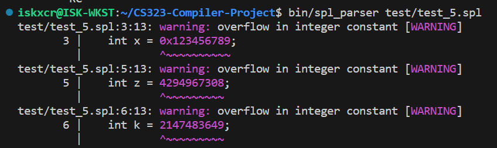

# CS323 Compiler Project Phase 1

Group: 12110529 CAO Zhezhen, 12110804 FANG Jiawei, 12110817 ZHANG Zhanwei.

*Sorted in alphabetical order.*


## Test Platform

| Name         | Value                                       |
| ------------ | ------------------------------------------- |
| OS           | Ubuntu 22.04.2 LTS on Windows 10 x86_64     |
| Bison        | bison (GNU Bison) 3.8.2                     |
| Flex         | flex 2.6.4                                  |
| libbison-dev | 2:3.8.2+dfsg-1build1                        |
| gcc          | gcc (Ubuntu 11.4.0-1ubuntu1~22.04) 11.4.0   |
| Make         | GNU Make 4.3. Built for x86_64-pc-linux-gnu |


## Compile

Before: `make clean`

Then: `make ` or `make splc`.


## Basic Feature List

All implemented.


## Extended Feature List

### Error Detection

- Hanging else

- Invalid function definition inside functions

- Various errors about missing parenthesis/square bracket:

  Run parser on `test/test_12110804_2.spl` for details on missing square brackets.

- Various errors about missing operands:

  

- Errors about invalid constant form:

  

  

### Other SPL Parser Features

- Optimized error/warning output

  

  **This may cause the `diff`** **utility not to work when doing batch verifying**, as ASCII control sequences are used to color the output and they will not be recognized by `diff`.

  **The output parsing tree will not get colored.**

  *This is done by using ASCII control sequences and reusable file descriptors. **Some of the SPL grammar structure is modified, but the target language does not change.***

  - `StmtList` *and* `DefList` *now **cannot** be empty.*

- Allowing unary operators: `+/-`, unary prefix/postfix operator: `++/--`

  Run parser on `test/test_5.spl` for details.

- Allowing `for` loop declaration

  - Allow any type of for loop combination:

    ```c
    for ([optional definition]; [optional expression]; optional expression)
        stmt
    ```

  *This is done by decomposing the for loop into **loop body** and **statement***.

  Run parser on `test_ex/test_6.spl` for details.

- Allowing the following floating-point declaration, given by `[0-9]*\.[0-9]+([eE][-+]?[0-9]+)?`:

  ```c
  float y = .3e-13;
  ```

  Run parser on `test-ex/test_3.spl` for details.

- Allowing single-line/cross-line comments

  ```c
  int main()
  {
      int a = 0; // This is a single comment.
      int b = 0; // This is a cross-line comment \
                    as you can tell by changing the language server interpreting this comment to match the C language.
      int c = 233; // Hi! C
      /*
      This is a cross-line comment.
      */
      int d = c;
      /* Hi!
      */
     
      */ // This is a hanging comment, which should not be recognized
  }
  ```

  

  *This is done by assigning* `yylex` *with specific states*.

  Run parser on `test-ex/test_4.spl` for details.

- Allow single-line/cross-line strings:

  - Allowed escape characters: `\[abefnrtv\'"?]`

  ```c
  int main()
  {
      char msg1 = "Hi Just want to test!";
  
      char msg2 = "Hi \
                      Just want to test!";
  
      char msg3 = "Hi"
                  "Thanks!";
      printf("[%s]", msg);
      return 0;
  }
  ```

  *This is done by assigning* `yylex` *with specific states*.

  Run parser on `test-ex/test_5.spl` for details.

There are other tests that do hybrid testing. You may check them out individually.

