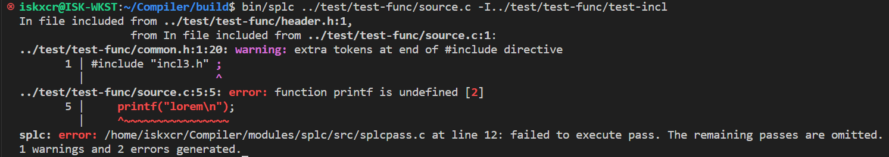

# CS323 Compiler Project Phase 2

Group: 12110529 CAO Zhezhen, 12110804 FANG Jiawei, 12110817 ZHANG Zhanwei.

*Sorted in alphabetical order.*


## Test Platform

| Name         | Value                                       |
| ------------ | ------------------------------------------- |
| OS           | Ubuntu 22.04.2 LTS on Windows 10 x86_64     |
| Bison        | bison (GNU Bison) 3.8.2                     |
| Flex         | flex 2.6.4                                  |
| libbison-dev | 2:3.8.2+dfsg-1build1                        |
| gcc          | gcc (Ubuntu 11.4.0-1ubuntu1~22.04) 11.4.0   |
| Make         | GNU Make 4.3. Built for x86_64-pc-linux-gnu |


## Compile and Run

The minimum required Bison version is **3.6**, which allows detailed error information, which allows detailed error information.

```shell
mkdir -p build && cd build
cmake ../
make
```

After successful compilation, run

```shell
bin/splc -h
```
to get help on various arguments.

## Tests

Tests provided by our team are placed under `test/self-test/phase2/`.

Extra test cases are placed under both `test/test-ex/` or `test/test-func/`.

## Basic Feature List

### Detections:

| Type | Description                                                  | Implemented?                                         |
| ---- | ------------------------------------------------------------ | ---------------------------------------------------- |
| 1    | Variable used without definition                             | Yes                                                  |
| 2    | Function invoked without definition                          | Yes                                                  |
| 3    | Redefinition of variable in the same scope                   | Yes                                                  |
| 4    | Redefinition of function in global scope                     | Yes                                                  |
| 5    | Unmatching types on both sides of the assignment operator    | Partial (**Implicit Cast**/**Explicit Cast**)        |
| 6    | **rvalue** appears on the left-hand side of the assignment operator | Yes                                                  |
| 7    | Unmatching operands                                          | Partial (**Implicit Cast**/**Explicit Cast**)        |
| 8    | Function's return type mismatch the declared type            | Yes                                                  |
| 9    | Functions' argument mismatches the declared type             | Yes                                                  |
| 10   | Applying indexing operator on non-array type variables       | Partial (Warning on types that cannot be derefenced) |
| 11   | Applying function invocation operator on non-function names  | Yes                                                  |
| 12   | Array indexing with a non-integer type expression            | Yes                                                  |
| 13   | Accessing members of a non-structure variable                | Yes                                                  |
| 14   | Accessing undefined structure member                         | Yes                                                  |
| 15   | Redefine the same structure type                             | Yes                                                  |


## Extended Features List

### Phase 2

#### Optional Rules


- **Extended Grammar**: now supports most of C99 and part of C11.

  | Features            | Implemented |
  | ------------------- | ----------- |
  | Atomic              | false       |
  | Pointers            | true        |
  | Address-of          | true        |
  | Struct, Union, Enum | true        |
  |                     |             |

  Please see the end of this report to get a glance at the full grammar supported.

- **Use with declaration but without definition**

#### Improvement to Programs

Test case:  `test/test-func/phase1.c ` (modified from `modules/splc/src/splcopt.c`)

```c
#define NULL (void *)0
typedef unsigned long long size_t;
/* From `splcdef.h` */

int splc_incl_dir_cnt = 0;
const char **splc_incl_dirs = NULL;

int splc_src_file_cnt = 0;
const char **splc_src_files = NULL;

/* From `splcopt.h` */

int splc_opterror = 1;
int splc_optind = 1;
char splc_optopt = '\0';
const char *splc_optfull = NULL;
const char *splc_optarg = NULL;

/* Own definitions */
typedef struct option
{
  int *const target_opt;
  const int opt_abbr;
  const char *opt_name;
} option;

#define OPT_CNT 5
static const option options[OPT_CNT] = {
  {&splcf_verbose, -1, "fverbose"},
  {&splcf_no_diagnostics_color, -1, "fno-diagnostics-color"},
  {&splcf_ast_dump, -1, "ast-dump"},
  {&splcf_enable_ast_punctuators, -1, "fenable-ast-punctuators"},
  {&splcf_no_ast_color, -1, "fno-ast-color"},
};

// clang-format off
void usage()
{
  printf("usage: \033[1m%s\033[0m [options] [file ...]\n%s%s%s%s%s%s%s", progname,
        "  -h                          print this usage and exit\n",
        "  -fverbose                   print all available diagnostic information\n",
        "  -fno-diagnostics-color      do not color diagnostic information\n",
        "  -ast-dump                   dump generated AST to stdout\n",
        "  -fenable-ast-punctuators    append punctuators in AST\n",
        "  -fcolor-ast                 color the output AST\n",
        "  -I<include-directory>       specify extra directory for #include search\n");
}
// clang-format on
/* omitted... */

void splc_process_args(const int nargc, const char *nargv[])
{
  /* content */
}
```

- **Recursive macro expansion**: Switch between different flex buffers.

- **Recursive file tracking**: The location tracking system and error reporting now traces file hierarchies.

  

  


## Appendix: Full Grammar

```

/* Entire translation unit */
translation-unit: 
      external-declaration-list
    | 
    ;

/* External definition list: Recursive definition */
external-declaration-list: 
      external-declaration 
    | external-declaration-list external-declaration 
    ;

/* External definition list: A single unit of one of . */
external-declaration: 
      SEMI 
    | declaration 
    | function-definition 
    ;

declaration-specifiers:
      storage-class-specifier 
    | type-specifier 
    | type-qualifier 
    | function-specifier 
    | declaration-specifiers type-specifier
    | declaration-specifiers storage-class-specifier
    | declaration-specifiers type-qualifier
    | declaration-specifiers function-specifier
    ;

storage-class-specifier:
      AUTO
    | EXTERN
    | REGISTER
    | STATIC
    | TYPEDEF
    ;

specifier-qualifier-list:
      type-specifier
    | type-qualifier
    | specifier-qualifier-list type-specifier
    | specifier-qualifier-list type-qualifier
    ;

type-specifier: 
      builtin-type-specifier
    | struct-or-union-specifier
    | enum-specifier
    | TYPEDEF_NAME
    ;

function-specifier:
      INLINE
    ;

type-qualifier:
      KWD_CONST
    | RESTRICT
    | VOLATILE
    ;

type-name:
      specifier-qualifier-list
    | specifier-qualifier-list abstract-declarator
    ;

builtin-type-specifier:
      TYPE_VOID
    | TYPE_INT
    | TYPE_FLOAT
    | TYPE_CHAR
    | TYPE_SIGNED
    | TYPE_UNSIGNED
    | TYPE_LONG 
    ;

abstract-declarator:
      pointer
    | pointer direct-abstract-declarator
    ;

direct-abstract-declarator:
      LP abstract-declarator RP
    | direct-abstract-declarator LSB assignment-expression RSB
    | direct-abstract-declarator LSB RSB
    ;

/* Specify a structure */
struct-or-union-specifier: 
      struct-or-union identifier
    | struct-or-union struct-declaration-body
    | struct-or-union identifier struct-declaration-body
    ;

struct-or-union:
      KWD_STRUCT
    | KWD_UNION
    ;

struct-declaration-body:
      LC RC
    | LC struct-declaration-list RC
    ;

struct-declaration-list:
      struct-declaration
    | struct-declaration-list struct-declaration
    ;

struct-declaration:
      specifier-qualifier-list SEMI
    | specifier-qualifier-list struct-declarator-list SEMI
    ;

struct-declarator-list:
      struct-declarator
    | struct-declarator-list COMMA struct-declarator
    ;

struct-declarator:
      declarator
    | COLON constant-expression
    | declarator COLON constant-expression
    ;

enum-specifier:
      KWD_ENUM identifier
    | KWD_ENUM enumerator-body
    | KWD_ENUM identifier enumerator-body
    ;

enumerator-body:
      LC RC
    | LC enumerator-list RC
    | LC enumerator-list COMMA RC
    ;

enumerator-list:
      enumerator
    | enumerator-list COMMA enumerator
    ;

enumerator:
      enumeration-constant
    | enumeration-constant ASSIGN constant-expression
    ;

enumeration-constant:
      identifier
    ;

/* Single variable declaration */
declarator: 
      pointer direct-declarator
    | direct-declarator
    ;

direct-declarator:
      identifier
    | LP declarator RP
    | direct-declarator LSB assignment-expression RSB
    | direct-declarator LSB RSB 
    ;

pointer:
      ASTRK
    | ASTRK type-qualifier-list
    | pointer ASTRK
    | pointer ASTRK type-qualifier-list
    ;

type-qualifier-list:
      type-qualifier
    | type-qualifier-list type-qualifier
    ;

/* Definition: Base */
declaration: 
      direct-declaration SEMI
    | direct-declaration error
    ;

direct-declaration:
      declaration-specifiers
    | declaration-specifiers init-declarator-list
    ;

/* Definition: Declaration of multiple variable.  */ 
init-declarator-list: 
      init-declarator
    | init-declarator COMMA init-declarator-list
    ;

/* Definition: Single declaration unit. */
init-declarator: 
      declarator
    | declarator ASSIGN initializer
    ;

initializer:
      assignment-expression
    | LC initializer-list RC
    | LC initializer-list COMMA RC
    ;

initializer-list:
      initializer
    | designation initializer
    | initializer-list COMMA designation initializer
    | initializer-list COMMA initializer
    ;

designation:
      designator-list ASSIGN
    ;

designator-list:
      designator
    | designator-list designator
    ;

designator:
      LSB constant-expression RSB
    | DOT identifier
    ;

function-definition:
      declaration-specifiers function-declarator compound-statement
    | function-declarator compound-statement
    | declaration-specifiers function-declarator SEMI
    ;

/* Function: Function name and body. */
function-declarator: 
      direct-function-declarator
    | pointer direct-function-declarator
    ;

direct-function-declarator:
      direct-declarator-for-function LP parameter-type-list RP
    ;

direct-declarator-for-function:
      identifier 
    ;

/* List of variables names */
parameter-type-list: 
      
    | parameter-list
    | parameter-list COMMA ELLIPSIS
    ;

parameter-list:
      parameter-declaration
    | parameter-list COMMA parameter-declaration 
    ;

/* Parameter declaration */ 
parameter-declaration: 
      declaration-specifiers declarator
    | declaration-specifiers abstract-declarator 
    | declaration-specifiers 
    ;

/* Compound statement: A new scope. */
compound-statement: 
      /* LC general-statement-list RC */
      LC general-statement-list RC 

      /* LC RC */
    | LC RC 
    ;

/* wrapper for C99 standard for statements */
general-statement-list: 
      statement 
    | declaration 
    | general-statement-list statement 
    | general-statement-list declaration 
    ;

/* Statement: List of statements. Recursive definition. */
/* statement-list: 
      statement 
    | statement-list statement 
    ; */

/* Statement: A single statement. */
statement: 
      SEMI 
    | compound-statement 
    | expression-statement 
    | selection-statement 
    | iteration-statement 
    | labeled-statement 
    | jump-statement 

    ;

expression-statement:
      expression SEMI
    ;

selection-statement:
      IF LP expression RP statement %prec THEN 
    | IF LP expression RP statement ELSE statement %prec ELSE 
    | SWITCH LP expression RP statement
    ;

labeled-statement:
      identifier COLON statement
    | CASE constant-expression COLON statement 
    | DEFAULT COLON statement 

    ;

jump-statement:
      GOTO identifier SEMI 
    | CONTINUE SEMI 
    | BREAK SEMI 
    | RETURN expression SEMI 
    | RETURN SEMI 
    ;

iteration-statement:
      WHILE LP expression RP statement
    | DO statement WHILE LP expression RP SEMI
    | FOR LP for-loop-body RP statement 
    ;

for-loop-body: 
      initialization-expression SEMI expression SEMI expression

    | SEMI expression SEMI expression
    | initialization-expression SEMI expression SEMI
    | initialization-expression SEMI SEMI expression

    | SEMI expression SEMI
    | SEMI SEMI expression
    | initialization-expression SEMI SEMI
    
    | SEMI SEMI
    ;

constant-expression: 
      conditional-expression
    ;

constant:
      LTR_INT
    | LTR_FLOAT
    | LTR_CHAR
    ;

primary-expression:
      identifier
    | constant
    | string-literal
    | LP expression RP
    ;

postfix-expression:
      primary-expression
    | postfix-expression LSB expression RSB
    | postfix-expression LP argument-list RP
    | postfix-expression member-access-operator identifier 
    | postfix-expression DPLUS
    | postfix-expression DMINUS
    | LP type-name RP LC initializer-list RC 
    | LP type-name RP LC initializer-list COMMA RC 
    ;

member-access-operator:
      DOT
    | RARROW
    ;

unary-expression:
      postfix-expression
    | DPLUS unary-expression
    | DMINUS unary-expression 
    | unary-operator cast-expression %prec UPLUS 
    | SIZEOF unary-expression 
    | SIZEOF LP type-name RP 
    /* | SIZEOF LP unary-expression RP {} */
    ;

unary-operator: /* Take the default behavior, that is, `$$ = $1` */
      BW_AND
    | ASTRK 
    | PLUS
    | MINUS
    | BW_NOT
    | NOT
    ;

cast-expression:
      unary-expression
    | LP type-name RP cast-expression 
    ;

multiplicative-expression:
      cast-expression
    | multiplicative-expression multiplicative-operator cast-expression 
    ;
  
multiplicative-operator:
      ASTRK
    | division-operator
    ;

division-operator:
      DIV
    | MOD
    ;

additive-expression:
      multiplicative-expression
    | additive-expression additive-operator multiplicative-expression 
    ;

additive-operator:
      PLUS
    | MINUS
    ;

shift-expression:
      additive-expression
    | shift-expression shift-operator additive-expression 
    ;
  
shift-operator:
      LSHIFT
    | RSHIFT
    ;

relational-expression:
      shift-expression
    | relational-expression relational-operator shift-expression 
    ;

relational-operator:
      LT
    | GT
    | LE
    | GE
    ;

equality-expression:
      relational-expression
    | equality-expression equality-operator relational-expression 
    ;

equality-operator:
      EQ
    | NE
    ;

BW-AND-expression:
      equality-expression
    | BW-AND-expression BW_AND equality-expression 
    ;

BW-XOR-expression:
      BW-AND-expression
    | BW-XOR-expression BW_XOR BW-AND-expression 
    ;

BW-OR-expression:
      BW-XOR-expression
    | BW-OR-expression BW_OR BW-XOR-expression
    ;

logical-AND-expression:
      BW-OR-expression
    | logical-AND-expression AND BW-OR-expression
    ;

logical-OR-expression:
      logical-AND-expression
    | logical-OR-expression OR logical-AND-expression 
    ;

conditional-expression:
      logical-OR-expression 
    | logical-OR-expression QM expression COLON conditional-expression 

    ;

assignment-expression:
      conditional-expression
    | conditional-expression assignment-operator assignment-expression 
    ;
    
assignment-operator: /* Use the default behavior to pass the value */
      ASSIGN 
    | MUL_ASSIGN
    | DIV_ASSIGN
    | MOD_ASSIGN
    | PLUS_ASSIGN
    | MINUS_ASSIGN
    | LSHIFT_ASSIGN
    | RSHIFT_ASSIGN
    | BW_AND_ASSIGN
    | BW_XOR_ASSIGN
    | BW_OR_ASSIGN
    ;

/* expressions */
expression: 
      assignment-expression 
    | expression COMMA assignment-expression 

    | expression COMMA error 
    | COMMA assignment-expression 
    ;
  
initialization-expression:
      expression
    | direct-declaration
    ;

/* Argument: List of arguments */
argument-list: 
   
    | argument-list COMMA assignment-expression
    | assignment-expression

    ;

/* String intermediate expression. Allowing concatenation of strings. */
string-literal: 
      STR_UNIT
    | string-literal STR_UNIT
    ;

identifier:
      ID 
    ;
```

