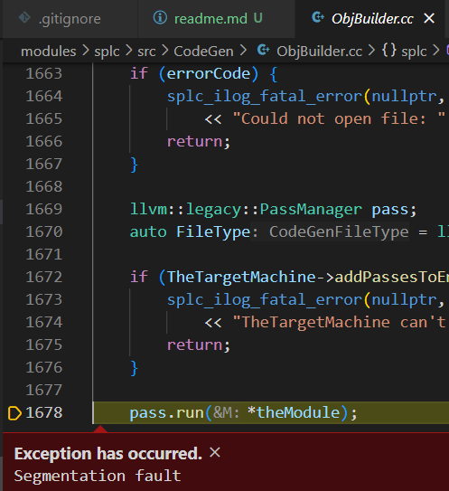

## test_01
Correct，但是splc compile过程出现
```
malloc_consolidate(): unaligned fastbin chunk detected
Aborted
```

## test_02
Segmentation fault

## test_03
Segmentation fault

## test_04
Segmentation fault

以上三个测试fault的位置均是



## test_05
```
Basic Block in function 'do_main' does not have terminator!
label %ifcont1834
test_05.c:4.1-30.2: error: /root/codes/CS323-Compilers/SPLC/modules/splc/src/CodeGen/ObjBuilder.cc:1498, at llvm::Function* splc::ObjBuilder::CGFuncDef(splc::Ptr<splc::AST>): this function is not well-formed according to the LLVM backend. This may be caused by unreachable code inside the provided source code. Try remove them and compile again. This function has been ignored.
       4 | int do_main()
         | ^~~~~~~~~~~~~
test_05.c:4.1-30.2: note: first defined here
       4 | int do_main()
         | ^~~~~~~~~~~~~
free(): double free detected in tcache 2
Aborted
```

## test_06
Correct